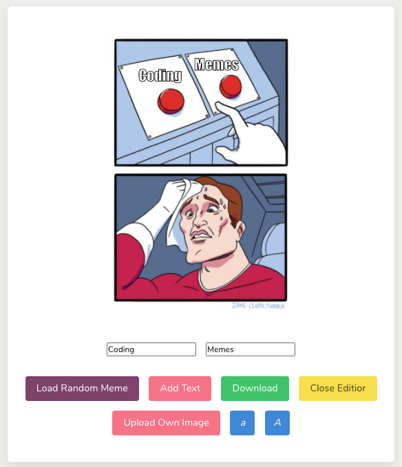

## Project Overview

With this Meme Generator, text can be added to images and downloaded to a local device.
The text can be edited, dragged and changed in size. The user may upload their own images.
You can find the live demo hosted [on Heroku](https://meme-factory22.herokuapp.com/#top).

## Acknowledgements

* App created with [React](https://reactjs.org/)
* Memes generated with [IMGFlip API](https://imgflip.com/api)
* Sass powered by [Bulma](https://bulma.io/)
* Draggable components with [React-Draggable](https://github.com/STRML/react-draggable)
* Image download with [DOM to Image](https://github.com/1904labs/dom-to-image-more)
