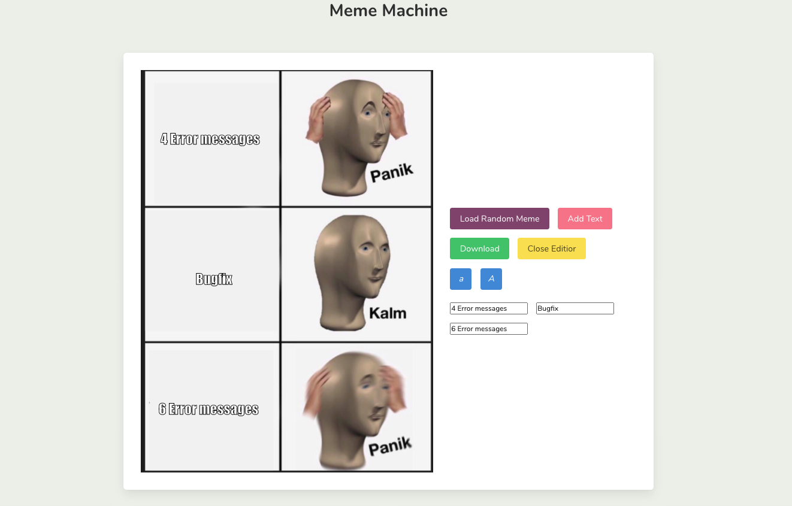

## Project Overview



In this App you can load a random Meme using the [Meme Generator Api](https://imgflip.com/api) and change the captions.
Individual Images can be uploaded and results can be downloaded with captions.
The Captions can be dragged and dropped.

## Getting Started

### Prerequisites

* Node JS
```sh
npm install
```
```sh
npm install dom-to-image
```

